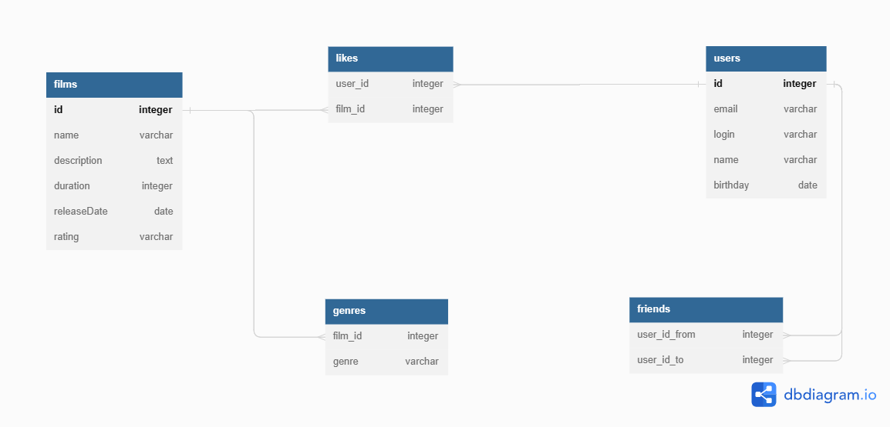

# java-filmorate
Template repository for Filmorate project.

Примеры запросов:
CREATE TABLE films (
        id INTEGER GENERATED BY DEFAULT AS IDENTITY PRIMARY KEY,
        name varchar NOT NULL,
        description varchar(200),
        release_date date,
        duration integer,
        rating varchar
        CONSTRAINT constr_release_date CHECK (release_date >= '1895-12-28'),
        constraint constr_duration check (duration > 0)
);

CREATE TABLE users (
	id INTEGER GENERATED BY DEFAULT AS IDENTITY PRIMARY KEY,
    email varchar,
  	login varchar,
  	name varchar,
  	birthday date
);

CREATE TABLE friends (
  	user_id_from INTEGER REFERENCES users (id) ON DELETE CASCADE,
  	user_id_to INTEGER REFERENCES users (id) ON DELETE CASCADE
);

CREATE TABLE likes (
	user_id INTEGER REFERENCES users (id) ON DELETE CASCADE,
  film_id INTEGER REFERENCES films (id) ON DELETE CASCADE
);

CREATE TABLE genres (
    film_id INTEGER REFERENCES films (id) ON DELETE CACADE,
    genre varchar
);

INSERT INTO films (name, description, release_date, duration, rating)
VALUES ( 'film1', 'fuuu', '2000-01-01', 4, '18+');

INSERT INTO films (name, description, release_date, duration, rating)
VALUES ( 'film2', 'guuu', '1999-01-01', 5, '18+');

INSERT INTO films (name, description, release_date, duration, rating)
VALUES ( 'film3', 'fuuu', '2000-01-01', 4, '18+');

INSERT INTO users (email, login, birthday, name)
VALUES ( 'user@mail', 'user1', '2000-01-01', 'user1');

INSERT INTO users (email, login, birthday, name)
VALUES ( 'user2@mail', 'user2', '2000-01-01', 'user2');

INSERT INTO users (email, login, birthday, name)
VALUES ( 'user3@mail', 'user3', '2000-01-01', 'user3');

INSERT INTO likes (user_id, film_id)
VALUES(1, 1);

INSERT INTO friends(user_id_from, user_id_to)
VALUES(1, 2);

INSERT INTO friends(user_id_from, user_id_to)
VALUES(2, 1);

INSERT INTO friends(user_id_from, user_id_to)
VALUES(1, 3);

INSERT INTO genres (film_id, genre)
VALUES(1, 'comedy');

select * from films;

Список подтвержденных друзей человека user_id

SELECT user_to
FROM (SELECT 
    f1.user_id_from as user_from,
    f1.user_id_to as user_to,
    f2.user_id_to as user_to_2
FROM friends f1 JOIN friends f2 on f1.user_id_to = f2.user_id_from) as u
WHERE user_from = user_to_2 AND user_from = (id человека);

Общие друзья двух людей
SELECT user_to
FROM (SELECT 
    f1.user_id_from as user_from,
    f1.user_id_to as user_to,
    f2.user_id_to as user_to_2
FROM friends f1 JOIN friends f2 on f1.user_id_to = f2.user_id_from) as u
WHERE user_from = user_to_2 AND user_from = (id человека 1)
AND user_to in (SELECT user_to
FROM (SELECT 
    f1.user_id_from as user_from,
    f1.user_id_to as user_to,
    f2.user_id_to as user_to_2
FROM friends f1 JOIN friends f2 on f1.user_id_to = f2.user_id_from) as u
WHERE user_from = user_to_2 AND user_from = (id человека 2));

топ-10 залайканых фильмов 
SELECT * 
FROM films f LEFT JOIN 
(SELECT 
film_id,
count(user_id)
FROM likes 
GROUP BY film_id)
as l ON f.id = l.film_id
ORDER BY l.count DESC NULLS LAST LIMIT 10;

жанры фильма
SELECT genre 
FROM genres 
WHERE film_id = (указать id фильма);
